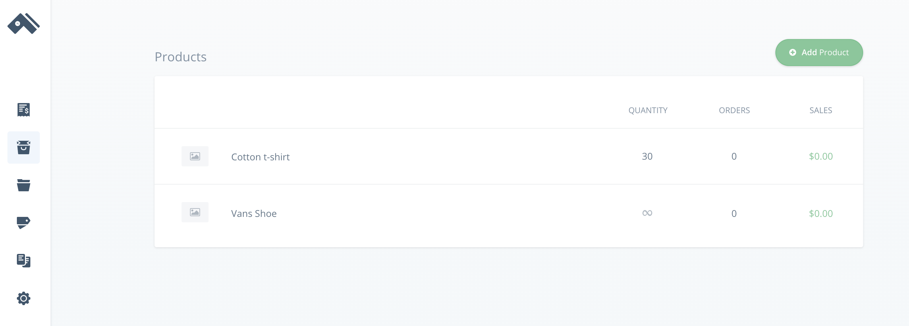

# Create a Cart with React and Three.js

This guide shows you how to set up a shopping cart using Commerce.js, React, Three.js, and React-Three-Fiber.

This guide uses the [Commerce.js](https://commercejs.com/) SDK (v2) and is a continuation of a previous guide— [Build a Product Detail page with React and Three.js](https://github.com/Andreloui5/CommerceWithThree/blob/master/README.md)

[View the live demo](https://xg2wo.csb.app/)


## Overview

Through this project, you will:

 * See how Commerce.js enables highly customized eCommerce sites
 * Use Commerce.js and [Three.js](https://threejs.org/) to build a scalable shopping cart with 3D elements

### Requirements
As with the last guide, you will need:

- A code editor/IDE of your choice
- A [Chec](https://authorize.chec.io/signup) account
- Node.js
- npm/yarn

### Prerequisites

It will help if you have some working knowledge of:
- JavaScript
- React
- Bootstrap


### Installation

In addition to the technologies used in the previous guide, you will need to use FontAwesome. Insert a link to the FontAwesome CDN in the `index.html` file of your project's `public` folder.
```html
<link rel="stylesheet" href="https://use.fontawesome.com/releases/v5.13.1/css/all.css" integrity="sha384-xxzQGERXS00kBmZW/6qxqJPyxW3UR0BPsL4c8ILaIWXva5kFi7TxkIIaMiKtqV1Q" crossorigin="anonymous">
```
You will also need to use `react-spring`, which you can install with npm.
```bash
npm i react-spring
```
### Project usage

**1. Uploading Products**

If you haven't done so already, create a [Chec](https://authorize.chec.io/signup) account. Once you have logged in, navigate to **Products**.



Add a few products to your list, just as you did with the Fleece Jacket in the last guide. (Click **Add Product** and enter information into the required fields).

This guide will be using a "Cotton T-Shirt" and "Vans Shoe." You can download both the [Cotton T-Shirt](https://sketchfab.com/3d-models/game-res-shirt-for-male-character-629d138b40054e01b82af4541e2bc16c) and the [Vans Shoe](https://sketchfab.com/3d-models/unused-blue-vans-shoe-96baa4684df7415ba8ba87d39bd1c2ee) for free from [sketchfab.com](https://sketchfab.com/feed).

Instead of adding only the name of the color option (Red, Blue, etc.) in the T-Shirt's variant section, include the hex value of that color as well. For example, this guide uses the color/hex values "Green #228B22", "Yellow #FFFF00", "White #FFFFFF", and "Purple #9400D3".

Leave the variants section empty for the shoe.

Click **Save Changes** at the bottom of the page and open your code editor.


**2. Setting up your file structure**

In addition to the files you have already created, you'll want to add five more to your components folder.
```
|--components
|  |--Cart.js
|  |--CartItem.js
|  |--FontAwesome.js
|  |--Loader.js
|  |--Navigation.js
```
**3. Adding CSS**

Since this guide is not focused on styling, replace the content in your styles.css folder with the following code:

<details>
<summary>Click to show css</summary>

```css
/* style.css */
body,
html,
canvas {
  width: 100vw;
  height: 100vh;
  margin:0;
  padding:0;
  background-color: #2D3047;
  background-image: linear-gradient(147deg, #2D3047 0%, #eae6e5 74%);
}

* {
  box-sizing: border-box;
}

.sr-only {
  z-index: 1;
}
/* Item Page Styling */
.item {
  background: #fafdff;
}

h2 {
  text-align: center;
  margin-top: 50px;
}

.info {
  margin: 30px 30px 15px 0;
  padding: 30px;
}

.buttonRow {
  margin-top: 80px;
}

/* Possible Item Colors */
.colorButton {
  border-radius: 50%;
  border-style: solid;
  border-width: 1px;
  border-color:#e6e6e6 ;
  width: 50px;
  height: 50px;
  margin-right: 10px;
  /* background: linear-gradient(145deg, #e6e6e6, #ffffff); */
  box-shadow:  20px 20px 60px #d9d9d9,
             -20px -20px 60px #ffffff;
}

.addToCart{
  float:right;
  margin-top: 0px;
  border-radius: 7px;
}

/* Keeps color buttons on item page from colliding on resize */
@media screen and (max-width: 929px ) {
  .colorButton,
  .addToCart {
    margin-top: 10px;
  }
}

@media screen and (max-device-width: 575px ) {
  canvas {
    width:100%;
    height: 100%;
  }
  .info {
    margin: 30px;
    padding: 30px;
  }

}

/* Navbar Styling */
.mainNav {
  height: 70px;
}

 /* Cart Styling */
 .cart{
  position: fixed;
  top: 70px;
  right: 0;
  height: 100vh;
  background: #2D3047;
  padding: 40px;
  z-index: 100;
  overflow: scroll;
  /* min-width: 230px; */
 }

.cart p {
  color: #ffffff;
}
.cart h4 {
  color: #ffffff;
}
.cart h3 {
  color: #ffffff;
}

#cartNumber {
  color: #ffffff;
  float: right;
  margin-left: 7px;
  font-size: 15px;
}

#cartButton {
  padding: 10px 15px;
}

.cartItem {
  padding: 0;
  max-block-size: inherit;
}

.cartInfo {
  margin-top: 20px;
}

#total{
  float: right;
  margin-top: 20px;
}

#buy {
  float: right;
  border-radius: 7px;
  margin: 10px 0 80px;
}

.quantityButton{
  height: 27px;
  width: 27px;
  border-radius: 50%;
  border-style: solid;
  border-width: .1px;
  border-color:#30334c ;
  background: linear-gradient(45deg, #30334c, #292b40);
  box-shadow:  20px 20px 60px #202232, -20px -20px 60px #3a3e5c;
}

span .fas {
  color: #ffffff;
}

.fa-trash {
  float:right;
}
```
</details>

**4. Handling State for your Cart**

In the last guide, you used React's `useEffect()` hook to fetch data from `commerce` and the `useState()` hook to set the state of `products` in `App.js`. You will need to set up a few more hooks in order to handle the state of your cart properly.

First, add the following to App.js
```js
const [cart, setCart] = useState();
const [numberOfItems, setNumberOfItems] = useState("");
```
Then add a call to `commerce` to retrieve the shopper's cart in the existing `useEffect()` method.
```js
 useEffect(() => {
    commerce.products.list().then((res) => {
      setProducts(res.data);
    });
    commerce.cart.retrieve().then((res) => {
      setCart(res);
    });
  }, []);
  ```
  Using the `retrieve()` method from `commerce` makes it possible for a shopper to add something to their cart, leave the page, and still have access to their cart when they return.

  Next, add a listener to `cart` so that you can update the `numberOfItems` in your cart (to display at the top right of the screen). Again, you can use the `useEffect()` hook, and place `cart` in the square brackets at the end of the hook. Doing this causes the `numberOfItems` to update whenever the `cart` changes.
```js
useEffect(() => {
    cart !== undefined
      ? setNumberOfItems(cart.total_items)
      : setNumberOfItems("");
  }, [cart]);
```

Since you are handling the state of your cart in App.js, you also need to add handlers for adding, updating, and removing items from your cart. These handlers should then be passed down to other components via `props.` If you would like to know more about the various methods used here, check out the [Commerce.js documentation](https://commercejs.com/docs/examples/add-to-cart.html).

To add products to your cart:
```js
  const addToCart = (productId, variantInfo) => {
    commerce.cart.add(productId, variantInfo).then((res) => {
      setCart(res.cart);
    });
  };
```
To update your cart, or remove an item if the user makes the quantity equal to 0:
```js
  const updateCart = (itemId, count) => {
    count === 0
      ? commerce.cart.remove(itemId).then((res) => setCart(res.cart))
      : commerce.cart.update(itemId, { quantity: count }).then((res) => {
          setCart(res.cart);
        });
  };
```
To remove an item from the cart:
```js
  const removeItemFromCart = (itemId) => {
    commerce.cart.remove(itemId).then((res) => setCart(res.cart));
  };
```


<details>
<summary>Click to see `App.js`</summary>

```js
//App.js
import React, { useState, useEffect } from "react";
import Commerce from "@chec/commerce.js";
import Item from "./components/Item";
import Navigation from "./components/Navigation";

const commerce = new Commerce(
  "YOUR SANDBOX KEY GOES HERE"
);

function App() {
  const [products, setProducts] = useState([]);
  const [cart, setCart] = useState();
  const [numberOfItems, setNumberOfItems] = useState("");

  useEffect(() => {
    commerce.products.list().then((res) => {
      setProducts(res.data);
    });
    commerce.cart.retrieve().then((res) => {
      setCart(res);
    });
  }, []);

  useEffect(() => {
    cart !== undefined
      ? setNumberOfItems(cart.total_items)
      : setNumberOfItems("");
  }, [cart]);

  const addToCart = (productId, variantInfo) => {
    commerce.cart.add(productId, variantInfo).then((res) => {
      setCart(res.cart);
    });
  };

  const updateCart = (itemId, count) => {
    count === 0
      ? commerce.cart.remove(itemId).then((res) => setCart(res.cart))
      : commerce.cart.update(itemId, { quantity: count }).then((res) => {
          setCart(res.cart);
        });
  };

  const removeItemFromCart = (itemId) => {
    commerce.cart.remove(itemId).then((res) => setCart(res.cart));
  };

  return (
    <div>
      <Navigation
        cart={cart}
        products={products}
        numberOfItems={numberOfItems}
        updateCart={updateCart}
        removeItemFromCart={removeItemFromCart}
      />
      {products.map((product) => (
        <Item key={product.id} {...product} addToCart={addToCart} />
      ))}
    </div>
  );
}

export default App;

```
</details>


**5.Modifying Item.js**

[The previous guide](https://github.com/Andreloui5/CommerceWithThree) kept `Item.js` as simple as possible— and because of that, it is not easily reusable. You can make it easily reusable (and thus scalable) by drilling into the `cart` object returned from `commerce`.

Also, to add cart functionality, you will need to change the "Buy Now" button into an "Add to Cart" button by passing down the `addToCart()` function that you just declared in `App.js`. (Make sure to pass `addToCart={addToCart}` to the `Item` component if you have not done so already).

Start by adding a hook to hold the Id of a user's chosen variables.
```js
const [optionId, setOptionId] = useState();
```
Now make a variable called `variantsAvailable`.
```js
const variantsAvailable = props.variants[0] !== undefined;
```
This (combined with a ternary operator in the return section of the component) enables `Item.js` to render properly if a product does not have any variants.

Additionally, since you combined the color name and hex value into one variant, write a function that will split the two apart, so that they can be used independently of one another.
```js
 const splitNameFromHex = (input) => {
    return input.split(" ");
  };
```

Since you need to drill fairly deep into the `cart` object to access the particulars of an item's variants, it is a good idea to make a variable that will simplify how your code reads. Combining this variable with a ternary operator lets you deal with any items that do not have variants.

```js
let variants;
  // checks for available variants in the product
  variantsAvailable
    ? (variants = props.variants[0].options)
    : (variants = null);
```

Next make handlers for picking variant colors and for adding items to your `cart.`

```js
  const handleColorChoice = (index) => {
    setColor(splitNameFromHex(variants[index].name)[1]);
    setOptionId(variants[index].id);
  };

  const handleAddToCart = (e) => {
    e.preventDefault();
    variants !== null
    //adds a product with a specific variant to your cart
      ? props.addToCart(props.id, 1, { [props.variants[0].id]: optionId })
    //adds a product, but doesn't specify a variant
      : props.addToCart(props.id);
  };
```

Now `Item.js` can be reused and scaled with just a few changes to what is returned.

```js
  return (
    <Row className="item">
      <Col sm={6} style={{ padding: 0 }}>
        <Animation {...props} uniqueId={props.id} color={color} />
      </Col>
      <Col className="info">
        <h2>{props.name}</h2>
        <br />
        <br />
        <p>{description}</p>
        <Row className="buttonRow">
          {/* checks for available color variants, and either renders buttons or an empty column */}
          {variantsAvailable ? (
            <Col>
              <p>Available Colors:</p>
              {/* maps through the different color variants, dynamically providing id name (to match CSS) and providing correct hex color options */}
              {variants.map((variant, index) => (
                <Button
                  key={splitNameFromHex(variants[index].name)[0]}
                  className={"colorButton"}
                  style={{
                    backgroundColor: splitNameFromHex(variants[index].name)[1],
                  }}
                  onClick={() => handleColorChoice(index)}
                ></Button>
              ))}
            </Col>
          ) : (
            <Col></Col>
          )}
          <Col style={{ textAlign: "right" }}>
            <p>Price: {props.price.formatted_with_symbol}</p>
            <Button
              className="addToCart"
              variant="primary"
              onClick={handleAddToCart}
            >
              Add to Cart
            </Button>
          </Col>
        </Row>
      </Col>
    </Row>
  );
}
```

<details>
<summary>Click to see the finished `Item` component</summary>

```js
//Item.js
import React, { useState } from "react";
import { Button, Col, Row } from "react-bootstrap";
import Animation from "./Animation";
import "./style.css";

function Item(props) {
  const [color, setColor] = useState();
  const [optionId, setOptionId] = useState();

  const description =
    props.description !== null
      ? props.description.slice(3, props.description.length - 4)
      : "";

  const variantsAvailable = props.variants[0] !== undefined;

  const splitNameFromHex = (input) => {
    return input.split(" ");
  };

  let variants;

  variantsAvailable
    ? (variants = props.variants[0].options)
    : (variants = null);

  const handleColorChoice = (index) => {
    setColor(splitNameFromHex(variants[index].name)[1]);
    setOptionId(variants[index].id);
  };

  const handleAddToCart = (e) => {
    e.preventDefault();
    variants !== null
      ? props.addToCart(props.id, 1, { [props.variants[0].id]: optionId })
      : props.addToCart(props.id);
  };

  return (
    <Row className="item">
      <Col sm={6} style={{ padding: 0 }}>
        <Animation {...props} uniqueId={props.id} color={color} />
      </Col>
      <Col className="info">
        <h2>{props.name}</h2>
        <br />
        <br />
        <p>{description}</p>
        <Row className="buttonRow">
          {variantsAvailable ? (
            <Col>
              <p>Available Colors:</p>
              {variants.map((variant, index) => (
                <Button
                  key={splitNameFromHex(variants[index].name)[0]}
                  className={"colorButton"}
                  style={{
                    backgroundColor: splitNameFromHex(variants[index].name)[1],
                  }}
                  onClick={() => handleColorChoice(index)}
                ></Button>
              ))}
            </Col>
          ) : (
            <Col></Col>
          )}
          <Col style={{ textAlign: "right" }}>
            <p>Price: {props.price.formatted_with_symbol}</p>
            <Button
              className="addToCart"
              variant="primary"
              onClick={handleAddToCart}
            >
              Add to Cart
            </Button>
          </Col>
        </Row>
      </Col>
    </Row>
  );
}

export default Item;
```
</details>


**6.Adding a Navigation Bar**

The next step in this project is adding a navigation bar and cart icon. To begin, move to the `Navigation.js` file you added earlier. Create a new component that uses the `useState()` method to keep track of whether the user has toggled the cart open or closed.

```js
// Navigation.js
import React, { useState } from "react";
import { Navbar, Nav, Button } from "react-bootstrap";

function Navigation(props) {
  const [isCartOpen, setIsCartOpen] = useState(false);

  return (
    <>
      <Navbar
        bg="dark"
        variant="dark"
        sticky="top"
        className="mainNav"
      >
        <Navbar.Brand href="#home">Commerce</Navbar.Brand>
        <Nav className="mr-auto"></Nav>
        <Button
          id="cartButton"
          variant="dark"
          onClick={() =>
            isCartOpen ? setIsCartOpen(false) : setIsCartOpen(true)
          }
        ></Button>
      </Navbar>
    </>
  );
}

export default Navigation;
```

To set up a cart icon that can be displayed in your navbar, open `FontAwesome.js` and create the following component:

```js
// FontAwesome.js
import React from "react";

const FontAwesome = ({ isCartOpen, numberOfItems }) => {
  return isCartOpen ? (
    <i
      className="fas fa-times"
      style={{ fontSize: "25px", padding: "12px" }}
    ></i>
  ) : (
    <div style={{ marginTop: "10px" }}>
      <i className="fas fa-shopping-cart" style={{ fontSize: "25px" }}></i>
      {numberOfItems === 0 ? <></> : <p id="cartNumber">{numberOfItems}</p>}
    </div>
  );
};
export default FontAwesome;
```
This component uses conditional logic to display only a shopping cart icon if the user's `cart` is empty. If the user has items in his or her `cart,` however, the number of items in the cart is displayed as well.

Now, import `FontAwesome` into `Navigation.js` and place it inside of the `<Button>` in your navbar. You will also need to pass the state of `isCartOpen` and the current `numberOfItems` to `FontAwesome` via props.
```js
  <FontAwesome
    isCartOpen={isCartOpen}
    numberOfItems={props.numberOfItems}
  />
```

Finally, open up `App.js,` import `Navigation.js` and insert the component above the `map()` of products, and include the necessary props:
```js
  <Navigation
    cart={cart}
    products={products}
    numberOfItems={numberOfItems}
    updateCart={updateCart}
    removeItemFromCart={removeItemFromCart}
  />
```

**7. Making the Cart Itself**

Next, turn your attention to `Cart.js`. Create a functional component and import `useSpring` and `animated` from `react-spring`. Then, instead of returning a regular `<div>`, return an `<animated.div>`. This allows react spring to animate the component. You will also need to specify the parameters of the animation. (If you want to know more about what this animation library can do, check out [react spring](https://www.react-spring.io/)).

Set up your `useSpring()` hook by declaring styling for the cart's open and closed states.
```js
const showCart = useSpring(
    props.isCartOpen
      ? {
          width: "40%",
          background: "#2D3047",
          opacity: 1,
        }
      : {
          width: "0%",
          background: "#eae6e5",
          opacity: 0,
        }
  );
```

The return value is a nested conditional statement. The first conditional statement handles the undefined state that comes while waiting for your call to commerce to complete. The second conditional toggles the cart's display between a message (if the cart is empty) and the cart's contents (once the user has added an item).

```js
return (
    <animated.div className="cart" style={showCart}>
      {props.cart !== undefined ? (
        <div>
          {props.cart.line_items.length === 0 ? (
            <h3 style={{ textAlign: "center" }}>
              Your cart is currently empty.
            </h3>
          ) : (
            <>
            {/* A map through your cart's line_items will go here */}
            </>
          )}
        </div>
      ) : (
        <></>
        )}
    </animated.div>
  );
}
```
`Commerce` makes it easy to map through the `line_items` that a user adds to the `cart.` For this guide, you can use the following code to set up your cart:

```js
<>
  {props.cart.line_items.map((item) => (
    <CartItem
      key={item.id}
      uniqueId={item.product_id}
      updateCart={props.updateCart}
      removeItemFromCart={props.removeItemFromCart}
      quantity={item.quantity}
      {...item}
    />
  ))}
  <Row>
    <Col>
      <h3 id="total">
        Total: {props.cart.subtotal.formatted_with_symbol}
      </h3>
    </Col>
  </Row>
  <Row>
    <Col>
      <a href={props.cart.hosted_checkout_url}>
        <Button id="buy" variant="primary">
          Buy Now
        </Button>
      </a>
    </Col>
  </Row>
</>
```
All together `Cart.js` should look something like this:

<details>
<summary>Click to see the finished `Cart` component</summary>

```js
// Cart.js
import React from "react";
import { useSpring, animated } from "react-spring";
import { Row, Col, Button } from "react-bootstrap";
import CartItem from "./CartItem";
import "./style.css";

function Cart(props) {
  const showCart = useSpring(
    props.isCartOpen
      ? {
          width: "40%",
          background: "#2D3047",
          opacity: 1,
        }
      : {
          width: "0%",
          background: "#eae6e5",
          opacity: 0,
        }
  );

  return (
    <animated.div className="cart" style={showCart}>
      {props.cart !== undefined ? (
        <div>
          {props.cart.line_items.length === 0 ? (
            <h3 style={{ textAlign: "center" }}>
              Your cart is currently empty.
            </h3>
          ) : (
            <>
              {props.cart.line_items.map((item) => (
                <CartItem
                  key={item.id}
                  uniqueId={item.product_id}
                  updateCart={props.updateCart}
                  removeItemFromCart={props.removeItemFromCart}
                  quantity={item.quantity}
                  {...item}
                />
              ))}
              <Row>
                <Col>
                  <h3 id="total">
                    Total: {props.cart.subtotal.formatted_with_symbol}
                  </h3>
                </Col>
              </Row>
              <Row>
                <Col>
                  <a href={props.cart.hosted_checkout_url}>
                    <Button id="buy" variant="primary">
                      Buy Now
                    </Button>
                  </a>
                </Col>
              </Row>
            </>
          )}
        </div>
      ) : (
        <></>
      )}
    </animated.div>
  );
}

export default Cart;
```
</details>

Before moving on, take a moment navigate back to `Navigation.js.` Import `Cart` and place the following code below the `Navbar` element.

```js
  <Cart
    isCartOpen={isCartOpen}
    cart={props.cart}
    products={props.products}
    updateCart={props.updateCart}
    removeItemFromCart={props.removeItemFromCart}
  />
```

**8. Making the Cart Item**

To complete your `cart`, you need a `CartItem.` Make that component now. You have already passed down the `updateCart()` and `removeItemFromCart()` functions that you created in App.js, which are now joined by each line item's individual properties.

To create the CartItem component, first integrate your functions into `onClick` event handlers.

```js
  const handleIncrement = (e) => {
    e.preventDefault();
    props.updateCart(props.id, props.quantity + 1);
  };

  const handleDecrement = (e) => {
    e.preventDefault();
    props.updateCart(props.id, props.quantity - 1);
  };

  const handleRemove = (e) => {
    e.preventDefault();
    props.removeItemFromCart(props.id);
  };
```
Then you can return a bootstrapped component that displays the appropriate animation, product details, and buttons to change the quantity of the item.

```js
return (
    <div>
      <Row style={{ maxHeight: "250px" }}>
        <Col className="cartItem">
          <Animation {...props} />
        </Col>
      </Row>
      <Row className="cartInfo">
        <Col xs={9}>
          <h4>{props.name}</h4>
        </Col>
        <Col xs={3}>
          <h4> {props.price.formatted_with_symbol}</h4>
        </Col>
      </Row>
      <Row>
        <Col xs={10}>
          <p>
            Quantity:{" "}
            <span>
              <button className="quantityButton" onClick={handleDecrement}>
                <i className="fas fa-minus"></i>
              </button>
            </span>{" "}
            {props.quantity}{" "}
            <span>
              <button className="quantityButton" onClick={handleIncrement}>
                <i className="fas fa-plus"></i>
              </button>
            </span>
          </p>
        </Col>
        <Col xs={2}>
          <span>
            <button className="quantityButton" onClick={handleRemove}>
              <i className="fas fa-trash"></i>
            </button>
          </span>
        </Col>
      </Row>
    </div>
```

<details>
<summary>Click to see the finished `CartItem` component</summary>

```js
//CartItem.js
import React from "react";
import { Col, Row } from "react-bootstrap";
import Animation from "./Animation";

const CartItem = (props) => {
  const handleIncrement = (e) => {
    e.preventDefault();
    props.updateCart(props.id, props.quantity + 1);
  };

  const handleDecrement = (e) => {
    e.preventDefault();
    props.updateCart(props.id, props.quantity - 1);
  };

  const handleRemove = (e) => {
    e.preventDefault();
    props.removeItemFromCart(props.id);
  };

  return (
    <>
      <Row style={{ maxHeight: "250px" }}>
        <Col className="cartItem">
          <Animation {...props} />
        </Col>
      </Row>
      <Row className="cartInfo">
        <Col xs={9}>
          <h4>{props.name}</h4>
        </Col>
        <Col xs={3}>
          <h4> {props.price.formatted_with_symbol}</h4>
        </Col>
        <Col xs={10}>
          <p>
            Quantity:{" "}
            <span>
              <button className="quantityButton" onClick={handleDecrement}>
                <i className="fas fa-minus"></i>
              </button>
            </span>{" "}
            {props.quantity}{" "}
            <span>
              <button className="quantityButton" onClick={handleIncrement}>
                <i className="fas fa-plus"></i>
              </button>
            </span>
          </p>
        </Col>
        <Col xs={2}>
          <span>
            <button className="quantityButton" onClick={handleRemove}>
              <i className="fas fa-trash"></i>
            </button>
          </span>
        </Col>
      </Row>
    </>
  );
};

export default CartItem;
```
</details>


**9. Different Animations in Scene.js**

`Commerce` makes it easy to reference specific items by giving each one a `uniqueId`. In the last guide, you used a custom permalink as a variable to link the appropriate scene.gltf file to Scene.js. For this guide, use each item's `uniqueId` and then set up a switch statement that includes the return value from each item's gltfjsx generated file.

```js
const { nodes, materials } = useLoader(
    GLTFLoader,
    `../${props.uniqueId}/scene.gltf`,
    draco("/draco-gltf/")
  );
```

```js
   function switchItem(item) {
    switch (item) {
      case "ADD THE UNIQUE ID FOR VANS SHOE HERE":
        return (
          <group
            ref={group}
            dispose={null}
            castShadow
            receiveShadow
            position={[0, -0.5, 0]}
          >
            <group rotation={[-Math.PI / 2, 0, 0]}>
              <mesh
                material={materials.Blue_Vans_Shoe}
                material-color={props.color}
                geometry={nodes.mesh_0.geometry}
                scale={[0.3, 0.3, 0.3]}
              />
            </group>
          </group>
        );

      case "ADD THE UNIQUE ID FOR T-SHIRT HERE":
        return (
          <group ref={group} dispose={null} castShadow receiveShadow>
            <group rotation={[-Math.PI / 2, 0, 0]}>
              <group rotation={[Math.PI / 2, 0, 0]}>
                <mesh
                  material={materials.lambert1}
                  material-color={props.color}
                  geometry={nodes.UV_d_lambert1_0.geometry}
                  scale={[0.8, 0.8, 0.8]}
                />
              </group>
            </group>
          </group>
        );

      default:
        return;
    }
  }
  return <>{switchItem(props.uniqueId)}</>;
```

<details>
<summary>Click to see the finished `Scene` component </summary>

```js
//Scene.js
import React, { useRef } from "react";
import { useLoader, useFrame } from "react-three-fiber";
import { GLTFLoader } from "three/examples/jsm/loaders/GLTFLoader";
import { draco } from "drei";

export default function Model(props) {
  const group = useRef();

  const { nodes, materials } = useLoader(
    GLTFLoader,
    `../${props.uniqueId}/scene.gltf`,
    draco("/draco-gltf/")
  );

  useFrame(() => (group.current.rotation.y += 0.003));

  function switchItem(item) {
    switch (item) {
      case "ADD THE UNIQUE ID FOR VANS SHOE HERE":
        return (
          <group
            ref={group}
            dispose={null}
            castShadow
            receiveShadow
            position={[0, -0.5, 0]}
          >
            <group rotation={[-Math.PI / 2, 0, 0]}>
              <mesh
                material={materials.Blue_Vans_Shoe}
                material-color={props.color}
                geometry={nodes.mesh_0.geometry}
                scale={[0.3, 0.3, 0.3]}
              />
            </group>
          </group>
        );

      case "ADD THE UNIQUE ID FOR T-SHIRT HERE":
        return (
          <group ref={group} dispose={null} castShadow receiveShadow>
            <group rotation={[-Math.PI / 2, 0, 0]}>
              <group rotation={[Math.PI / 2, 0, 0]}>
                <mesh
                  material={materials.lambert1}
                  material-color={props.color}
                  geometry={nodes.UV_d_lambert1_0.geometry}
                  scale={[0.8, 0.8, 0.8]}
                />
              </group>
            </group>
          </group>
        );

      default:
        return;
    }
  }
  return <>{switchItem(props.uniqueId)}</>;
}
```
</details>

These new models recieve light differently than the jacket did in the previous guide. So navigate to `Animation.js`, remove `<pointLight>` and then replace `<ambientLight>` and `<spotLight>` with the following:

```js
  <ambientLight intensity={0.5} />
  <spotLight
    castShadow
    intensity={1}
    angle={Math.PI / 8}
    position={[25, 25, 15]}
    shadow-mapSize-width={2048}
    shadow-mapSize-height={2048}
  />
```

**10. Adding a Spinner**

It is always a good practice to have some immediate feedback for a user while content loads. Because the models can take some time to populate, import a `Spinner` from `react-bootstrap` and add it to `Loader.js.` Then import `HTML` from `drei` and wrap it around the `Spinner` so that the component will correctly display over the `canvas` element.

```js
import React from "react";
import { Spinner } from "react-bootstrap";
import { HTML } from "drei";

const Loader = () => (
  <HTML>
    <Spinner animation="border" role="status">
      <span className="sr-only">Loading...</span>
    </Spinner>
  </HTML>
);

export default Loader;
```
Navigate back to `Animation.js` and make `<Loader >` the fallback for `<Suspense >.`

**11. That's it!**

You should have an application that uses `Commerce.js` to manage a user's cart and that dynamically renders `Three.js` product models.

[View the live demo](https://xg2wo.csb.app/)

Check out the next guide in this series and learn how to [create a checkout with React and Three.js](https://github.com/Andreloui5/3DCreditCardForm).

## Built With

* [Commerce.js](https://commercejs.com/) - SDK for Chec commerce platform
* [Drei](https://github.com/react-spring/drei) - Helper components for react-three-fiber
* [Font Awesome](https://fontawesome.com/) - Scalable icon library
* [Gltfjsx](https://github.com/react-spring/gltfjsx) - Converts gltf files into jsx components
* [React.js](https://reactjs.org/) - The web framework used
* [React-Bootstrap](https://react-bootstrap.github.io/) - CSS framework for React
* [React-Spring](https://www.react-spring.io/) - Spring-physics based animation library
* [React-Three-Fiber](https://github.com/react-spring/react-three-fiber) - Reconciler for Three.js
* [Three.js](https://threejs.org/) - JavaScript 3D library

## Author

* **Craig Gant** - [Github](https://github.com/Andreloui5)