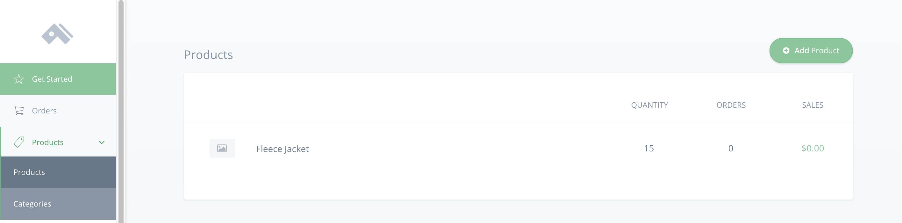

# Create a Product Detail Page with React and Three.js

This guide shows you how to set up a basic product detail page using Commerce.js, React, Three.js, and React-Three-Fiber.

This guide uses the [Commerce.js](https://commercejs.com/) SDK (v2).

[View the live demo](https://po30k.csb.app/)


## Overview

Through this project, you will:

 * See how Commerce.js enables highly customized eCommerce sites
 * Use [Three.js](https://threejs.org/) to build an interactive product detail page with some basic 3D elements
 * Use Commerce.js to provide data for your page

### Requirements

- Code editor/IDE of your choice
- A [Chec](https://authorize.chec.io/signup) account
- Node.js
- npm/yarn

### Prerequisites

It will help if you have some working knowledge of:
- JavaScript
- React
- Bootstrap


### Installation

To begin, you need to create a React application ([create-react-app](https://create-react-app.dev/docs/getting-started/) is an easy way to do this). Next, install Commerce.js, Three.js, React Bootstrap, and React-Three-Fiber.


```bash
# Install the Commerce.js SDK, Three.js, React Bootstrap, and React-Three-Fiber
npm install @chec/commerce.js three react-bootstrap react-three-fiber drei
```

You also need to insert a link to a Bootstrap CDN in the `index.html` file of your project's `public` folder.
```html
<link href="https://stackpath.bootstrapcdn.com/bootswatch/4.5.0/lux/bootstrap.min.css" rel="stylesheet" integrity="sha384-smnSwzHqW1zKbeuSMsAM/fMQpkk7HY11LuHiwT8snL/W2QBoZtVCT4H5x1CEcJCs" crossorigin="anonymous">
```
### Project usage

**1. Uploading Products**

If you haven't done so already, create a [Chec](https://authorize.chec.io/signup) account. Once you're logged in, navigate to **Products**.



Click **Add Product** and enter the following minimum required fields (for the sake of following the same UI as this demo, specify the same fields):
1. **Product name**: Fleece Jacket
2. **Price**: 60
3. **Product Description**: Be better prepared for anything Mother Nature can throw at you with this fleece jacket. When you step outside and find adventure, know that this jacket will keep you feeling nice and toasty.
4. **Permalink**: jacket
5. Any quantity
6. **Variant**: Color
  - Options: Blue, Red, Flax

Click **Save Changes** at the bottom of the page and open your code editor.


**2. Setting up your file structure**

If you used `create-react-app`, there are several files you won't need for this guide. You can delete everything in the `src` folder except `index.js` and `App.js`. Next, create a `components` folder with the following files:

```
src
|--components
|  |--Animation.js
|  |--Controls.js
|  |--Item.js
|  |--style.css
App.js
index.js
```

**3. Using Commerce.js**

In `App.js`, import `Commerce` and create a variable with your sandbox public key. (You can find your key in the [Developer section](https://dashboard.chec.io/setup/developer) of Chec Dashboard's 'Setup' tab).

The top of `App.js` should now look something like this:

```js
// App.js

import React from "react";
import Commerce from "@chec/commerce.js";

const commerce = new Commerce(
  "YOUR SANDBOX KEY GOES HERE"
);
```

Next, import `useState()` and `useEffect()` from React, and set up a hook with `products` and `setProducts`. You'd need to then wrap the `commerce` object in the `useEffect` hook. Doing so tells React to do something after render— in this case, fetch data from `commerce` and update the state of `products`.

```js
// App.js

import React, { useState, useEffect } from "react";
import Commerce from "@chec/commerce.js";
import Item from "./components/Item";

const commerce = new Commerce(
  "YOUR SANDBOX KEY GOES HERE"
);

function App() {

  const [products, setProducts] = useState([]);

  useEffect(() => {
    commerce.products.list().then((res) => {
      setProducts(res.data);
    });
  }, []);

  return (
    <div></div>
  );
}

export default App;

```
Check out the [Commerce.js documentation](https://commercejs.com/docs/overview/getting-started.html) to learn more about the particular method we used and to see what else it can do for your eCommerce business.

**4. Building the Product Detail Page**

Copy the following code into `Item.js`:
```js
// Item.js

import React, { useState } from "react";
import { Button, Col, Row } from "react-bootstrap";
import Animation from "./Animation";
import "./style.css";

function Item(props) {
  const [color, setColor] = useState("#80CED7");

  const description =
    props.description !== null
      ? props.description.slice(3, props.description.length - 4)
      : "";

  return (
    <Row className="item">
      <Col sm={6}>
        <Animation {...props} color={color} />
      </Col>
      <Col className="info">
        <h2>{props.name}</h2>
        <br />
        <br />
        <p>{description}</p>
        <Row className="buttonRow">
          <Col>
            <p>Available Colors:</p>
            <Button id="blue" onClick={() => setColor("#80CED7")}></Button>
            <Button id="flax" onClick={() => setColor("#E9D985")}></Button>
            <Button id="red" onClick={() => setColor("#BF211E")}></Button>
          </Col>
          <Col style={{ textAlign: "right" }}>
            <p>Price: {props.price.formatted_with_symbol}</p>
            <a href={props.checkout_url.display}>
              <Button id="buy" variant="primary">
                Buy Now
              </Button>
            </a>
          </Col>
        </Row>
      </Col>
    </Row>
  );
}

export default Item;
```
This component uses react-bootstrap's responsive grid and takes advantage of the `useState` hook to store different color options.  These colors are passed to `Animation.js` via props, which makes it possible to change the color of our jacket. Also, props provide a dynamic way to inject product details into your page.

**5. Mapping our product**

Navigate back to `App.js` and map through `products`, passing `props` and rendering an `Item` for each `product`.
```js
// App.js

return (
    <div>
      {products.map((product) => (
        <Item key={product.id} {...product} />
      ))}
    </div>
  );
```

You can confirm that everything is working by commenting out the `Animation` element. You should see the unstyled data retrieved from Commerce.js.

**6. Styling**

Before setting up your Three.js scene, you need to add some CSS so the canvas element will render correctly. So it is a good time to add all the CSS this project requires.
```css
// style.css

body,
html,
canvas {
  width: 100vw;
  height: 100vh;
  margin:0;
  padding:0;
  background-color: #2D3047;
  background-image: linear-gradient(147deg, #2D3047 0%, #eae6e5 74%);
}

* {
  box-sizing: border-box;
}

.item {
  background: #fafdff;
}

h2 {
  text-align: center;
  margin-top: 50px;
}

.info {
  margin: 30px 30px 15px 0;
  padding: 30px;
}

.buttonRow {
  margin-top: 80px;
}

#blue {
  border-radius: 50%;
  width: 50px;
  height: 50px;
  margin-right: 10px;
  background-color: #80CED7;
}

#flax {
  border-radius: 50%;
  width: 50px;
  height: 50px;
  margin-right: 10px;
  background-color: #E9D985;
}

#red{
  border-radius: 50%;
  width: 50px;
  height: 50px;
  margin-right: 10px;
  background-color: #BF211E;
}

#buy{
  float:right;
  margin-top: 0px;
  border-radius: 7px;
}

@media screen and (max-width: 929px ) {
  #blue,
  #flax,
  #red,
  #buy {
    margin-top: 10px;
  }
}

@media screen and (max-device-width: 575px ) {
  canvas {
    width:100%;
    height: 100%;
  }
  .info {
    margin: 30px;
    padding: 30px;
  }
}
```

**7. Implementing Three.js and React-Three-Fiber**

[Three.js](https://threejs.org/) is a JavaScript library that enables a developer to create and run 3D graphics in the browser. It does this by using WebGL to access a computer's graphics hardware directly, providing the speed needed to handle the complex mathematical calculations behind 3D graphics.

[React-three-fiber](https://github.com/react-spring/react-three-fiber) is a reconciler for Three.js. It allows you to use the entirety of the Three.js library while allowing you to use declarative language to build scenes. For example, with react-three-fiber, ` new THREE.Mesh()` is simplified to `<mesh />`. Thus, using `react-three-fiber` maintains the look and feel of the React ecosystem, while enabling you to create whatever you like with Three.js.

**8. Setting up the Scene**

For this project, you should start by defining a canvas in the `Animation.js` file. The `Canvas` is the base element of Three.js, and all other elements of a scene should be rendered inside of it.
```js
// Animation.js

import React, { Suspense } from "react";
import { Canvas } from "react-three-fiber";
import Controls from "./Controls";
import Model from "./Scene";

function Animation(props) {
  return (
    <Canvas
      camera={{
        fov: 40,
        position: [0, 0.2, 4],
      }}
      shadowMap
    >

    </Canvas>
  );
}

export default Animation;
```
The scene then needs some lighting. Adding ambient light, a point light, and a spotlight to your canvas will be enough for this guide. Note that `position` takes an array of three numbers. This array then controls the x, y, and z coordinates of the element.

```js
// Animation.js

<Canvas
  camera={{
    fov: 40,
    position: [0, 0.2, 4],
  }}
  shadowMap
>
  <ambientLight intensity={4} />
  <pointLight intensity={6} position={[-10, -25, -10]} />
  <spotLight
    castShadow
    intensity={8}
    angle={Math.PI / 8}
    position={[25, 25, 15]}
    shadow-mapSize-width={2048}
    shadow-mapSize-height={2048}
  />
</Canvas>
```

It's also a good idea to add some camera controls to the scene. Add import and extend orbit controls by copying the following into `Controls.js`:
```js
// Controls.js

import React, { useRef } from "react";
import { OrbitControls } from "three/examples/jsm/controls/OrbitControls";
import { extend, useThree, useFrame } from "react-three-fiber";

extend({ OrbitControls });

export default function Controls(props) {
  const { gl, camera } = useThree();
  const ref = useRef();
  useFrame(() => ref.current.update());
  return <orbitControls ref={ref} args={[camera, gl.domElement]} {...props} />;
}
```

Now you can add `<Controls>` to `Animation.js`. After adding the controls element to the scene (and giving it some properties), your `Animation.js` file should look something like this:

```js
// Animation.js

import React, { Suspense } from "react";
import { Canvas } from "react-three-fiber";
import Controls from "./Controls";
import Model from "./Scene";

function Animation(props) {
  return (
    <Canvas
      camera={{
        fov: 40,
        position: [0, 0.2, 4],
      }}
      shadowMap
    >
      <Controls
        autoRotate
        enablePan={false}
        enableZoom={false}
        enableDamping
        dampingFactor={0.5}
        rotateSpeed={1}
        maxPolarAngle={Math.PI / 2}
        minPolarAngle={Math.PI / 2}
      />
      <ambientLight intensity={4} />
      <pointLight intensity={6} position={[-10, -25, -10]} />
      <spotLight
        castShadow
        intensity={8}
        angle={Math.PI / 8}
        position={[25, 25, 15]}
        shadow-mapSize-width={2048}
        shadow-mapSize-height={2048}
      />
    </Canvas>
  );
}

export default Animation;

```

**9. Adding the Model**

The next step in creating a scene is to put at least one object into the canvas. It is entirely possible to create your own objects with Three.js. However, it is a bit beyond the scope of this guide.

Instead, you can import an already completed object/model. Sketchfab has a lot of beautiful (and free) 3D models that you can use. For this project, use this [Jacket](https://sketchfab.com/3d-models/advanced-game-characters-week-2-jacket-8f211f057bb24f5db17ca659553b716b).

Once you've downloaded and unzipped the file, rename the folder to 'Jacket' and then open a terminal at its location. Use [gltfjsx](https://github.com/react-spring/gltfjsx) to take the file and make it into a react component with the following code.
```bash
npx gltfjsx scene.gltf -d -compress
```
When you open the file now, there should be a file named `Scene.js`. Add that file to your `components` folder, and put the other files in the `public` folder.

Open `Scene.js` and modify the relative path to the `Jacket` folder by replacing it with an object literal. By doing this, you can leverage the custom permalink you made at the start of this tutorial. As long as you load a folder to `public` with the same name as a product's custom permalink, it will render automatically.
```js
// Scene.js

export default function Model(props) {
  const group = useRef();
  const { nodes, materials } = useLoader(
    GLTFLoader,
    `../${props.permalink}/scene.gltf`,
    draco("/draco-gltf/")
  );
```

**Please Note:** The way this guide renders models works well for two or three items maximum. After that, performance will start to suffer. (The browser also limits how many canvases you can have at a given time). [Threejsfundamentals](https://threejsfundamentals.org) has a fix for this [issue](https://threejsfundamentals.org/threejs/lessons/threejs-multiple-scenes.html). However, to keep things brief, this guide does not address it.

Before navigating away from your model, add `material-color={props.color}` to the `<mesh>` and remove `{...props}` from the first `<group>`. This will enable the model to change colors when a user clicks the appropriate button.

You can now add import `<Model />` to `Animation.js`. The GTLFLoader is promised based, and should be used in conjunction with React's `<Suspense />`.

```js
// Animation.js

<Suspense fallback={null}>
  <Model {...props} />
</Suspense>
```

**10. That's it!**

You should have a working product page that integrates Commerce.js with Three.js. Hopefully it gives you a great starting point for using 3D graphics in your own eCommerce site.


[Live Demo](https://po30k.csb.app/)

Check out the next guide in this series and learn how to [create a shopping cart with React and Three.js](https://github.com/Andreloui5/CommerceWithThree-part2)

## Built With

List all frameworks/tools used.

* [Commerce.js](https://commercejs.com/) - eCommerce SDK
* [Drei](https://github.com/react-spring/drei) - Helper components for react-three-fiber
* [Gltfjsx](https://github.com/react-spring/gltfjsx) - Converts gltf files into jsx components
* [React.js](https://reactjs.org/) - The web framework used
* [React-Bootstrap](https://react-bootstrap.github.io/) - CSS framework for React
* [React-Three-Fiber](https://github.com/react-spring/react-three-fiber) - Reconciler for Three.js
* [Three.js](https://threejs.org/) - JavaScript 3D library

## Author

* **Craig Gant** - [Github](https://github.com/Andreloui5)
