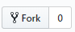
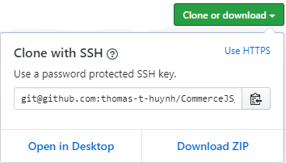
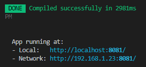
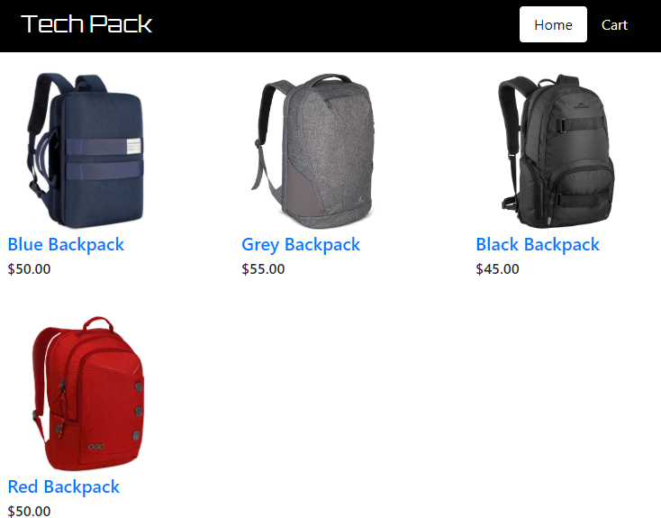

# Handling Cart Checkout with Commerce.js using Vue.js

This guide will take you through the checkout process for an eCommerce site using Commerce.js and Vue.js. The checkout process gives the vendor information on where to deliver the product, and on how they will charge the customer. At the end of the process, an order confirmation is shown to verify the purchase and to summarize details about the order.

Commerce.js v2 will be used in this guide.

[Live_demo](https://codesandbox.io/s/nervous-leaf-dfqzl)

## Overview

This is a continuation of [Adding Products to Cart with Commerce.JS using Vue.js](https://github.com/thomas-t-huynh/CommerceJS_How_to_handle_cart_VueJS).

If you haven’t done so already, create an account so you can access the Chec Dashboard and add products through your dashboard. In this guide, backpacks will be the products used for demonstration.

This guide will cover:

- Cloning and installing the base project.
- Generating a checkout token to set up form fields
- Using the Commerce.js ‘live’ object to dynamically render the order summary
- Handling delivery form and payment form logic
- Capturing a token and then showing the order confirmation

## Requirements

- IDE Code Editor
- NPM or yarn
- Vue JS
- Bootstrap
- Git

## Prerequisites

- Basic web development knowledge in HTML, CSS, and JS
- Some knowledge Single-page application design

## Initial Setup

First, visit the [base repo page](https://github.com/thomas-t-huynh/CommerceJS_How_to_handle_Checkout_VueJS_BASE)

Fork your own repository.



Clone or download the repo. This setup will go down the cloning path so copy the link shown in the popover.



Open a terminal of your choice, find a directory to store your project, and then enter in `git clone clone-url`.

```
git clone git@github.com:thomas-t-huynh/CommerceJS_How_to_handle_Checkout_VueJS_BASE.git
```

CD into the directory.

```
Cd CommerceJS_How_to_handle_Checkout_VueJS_BASE
```

Run npm install to get all the required modules

```
Npm install
```

Start up development by running this script.

```
Npm run serve
```

Visit the localhost link shown in your terminal.



The app should look like this.



Access the cloned project directory with an IDE of your choice, and get ready to code!

## Project Tutorial

### 1. Setting up the Checkout Page

Buying a product online requires a large amount of information so it could arrive accurately to your doorstep. The checkout process requires info in specific formatting for some fields such as email or country. Thankfully, there are Commerce.js methods that could help set up some form data.

Starting off, visit the `CartPage.vue`. There should be a method called `pushToCheckoutPage` attached to the checkout button in the template. The method itself is this.

```js
// CartPage.vue
pushToCheckoutPage() {
    this.$router.push(`/checkout/${this.cart.id}`);
  }
```

When a user clicks this button, it will send them to the checkout page with the delivery form on it. Passing cart id as a parameter primarily serves to get the checkout token, but it will also persist the checkout process if the page happens to refresh or if the user wants to return to the checkout page.

Before working on the checkout page, go into `App.vue` and pass down commerce as props into the router-view for the checkout page later on.

```html
<!-- App.vue -->
<router-view ... :commerce="commerce" />
```

The SDK will be used very often during the checkout process, and it can be completely managed by `CheckoutPage.vue`. This will prevent multiple levels of [emitting](https://vuejs.org/v2/guide/components.html), and all checkout logic will modularize in one file.

A quick brush up on emitting. Emitting is a way for a child component to pass data up to the parent component. The child component does this by using the built-in emit method, and passes in a string argument to represent the name of the event.

`this.$emit("eventName")`

The parent component listens for the string that's passed in, and calls the function assigned to the listener to handle the event. The event listener is binded to the child component in the parent file.

```html
<!-- ParentFile.vue -->
<ChildComponent @eventName="handlerFunction" />
```

In the pages directory, create a file and name it `CheckoutPage.vue`. Copy and paste the code below to quickly get a basic layout.

```html
<!-- CheckoutPage.vue -->
<template>
  <div>
    CheckoutPage
  </div>
</template>

<script>
  export default {
    name: "CheckoutPage",
    props: {
      commerce: {
        type: Object
      }
    },
    created() {}
  };
</script>

<style scoped></style>
```

This is a new route that’s not hooked up to the VueRouter yet. Navigate into `main.js`, import in `CheckoutPage.vue`, and add the object containing the new route’s properties.

```js
//main.js
{
  path: "/checkout/:id",
  name: "CheckoutPage",
  component: CheckoutPage,
}
```

Test the route by clicking the secure checkout button in `CartPage.vue`.

#### Generating checkout token and using Commerce.js services

With the `CheckoutPage.vue` now in place, it’s time to make use of the cart id that was passed through.

In `CheckoutPage.vue`, make a `created()` method, and then add the following block of code in.

```js
// CheckoutPage.vue
created() {
    const getCartId = this.$route.params.id;
    this.commerce.checkout
      .generateToken(getCartId, { type: "cart" })
      .then(res => {
        this.checkoutToken = res;
        this.live = res.live;
      })
      .catch(err => console.log(err));

    this.commerce.services
      .localeListCountries(this.checkoutToken.id)
      .then(res => {
        this.countries = { "": "Select a country", ...res.countries };
      })
      .catch(err => console.log(err));

    this.commerce.services
      .localeListSubdivisions("US")
      .then(res => {
        this.states = { "": "Select a state", ...res.subdivisions };
      })
      .catch(err => console.log(err));
  }
```

Okay, so starting at the top is `const getCartId = this.$route.params.id;`. This contains the id of the cart so you can retrieve the checkout token. Lets take a peek at some of the object's content.


It’s always a good idea to check objects that are returned so you can find useful properties.

The following Commerce.js calls is why the `created()` method is in use. [Asynchronous](https://developer.mozilla.org/en-US/docs/Learn/JavaScript/Asynchronous) API calls have a delayed response so having these calls in `created()` ensures that their returned values will be rendered.

Moving on to `this.commerce.checkout.generateToken()`. This method can be called with a permalink, which is why the type has to be specified. The response from the call is a checkout token that contains its ID used for capturing the token, and to access built-in helper functions. The token and the live property is assigned to the data states.

The live object holds ‘real-time’ data on the checkout total. Helper functions that check for tax or for available shipping can alter the total price of the checkout, and the live object returned form these functions can reflect these changes.

Create default values in the component’s data method to house the states. In addition to that, make the properties for countries and states for the next steps.

```js
// CheckoutPage.vue
   data() {
    return {
      checkoutToken: {},
      live: undefined,
      countries: {},
      states: {},
    };
  },
```

Now with the checkout token in the state, the last two methods `services.localeListCountries(this.checkoutToken.id)` and `services.localeListSubdivisions(“US”)` will be covered.

The responses should return objects of countries and subdivisions that can be shipped out to the current checkout. The concatenated objects shown above will serve only as display values for users to select a location. These returned objects will be assigned to the states you made earlier.

### 2. Creating the delivery form and handling changes

It's a good idea to grab the location data from Chec's API because it contains the locations that Chec supports, and the data is in a format that the API understands.

The delivery form will emit events on every keystroke, which could lead to a very dynamic form experience for users.

Create `DeliveryForm.vue` in the components folder, and then copy and paste this in.

```html
<!-- DeliveryForm.vue -->
<template>
  <form name="deliveryForm" @submit="onSubmit">
    Delivery form
  </form>
</template>

<script>
  export default {
    name: "DeliveryForm",
    props: ["states", "countries"]
  };
</script>

<style scoped></style>
```

The name in the form will be useful later on to detect where the event is firing from.

Rather than rendering `DeliveryForm.vue` as a component, this guide will introduce [nested routes](ttps://router.vuejs.org/guide/essentials/nested-routes.html).

Access the router in `Main.js`, import `DeliveryForm.vue`, and add an additional property named `children` that holds an array of route objects.

```js
// main.js
{
  path: "/checkout/:id",
  name: "CheckoutPage",
  component: CheckoutPage,
  children: [
    {
      path: "deliveryform",
      component: DeliveryForm
    }
  ]
}
```

Nested routing allows for rendering of a route within a route itself. This will make the checkout page similar to the `App.vue` page as it will host a router-view tag in its template too.

The way to access the child routes is by appending the child’s path at the end of the parent route’s path.

```
"/checkout/:id/deliveryform"
```

This means you will have to change the link in `CartPage.vue`.

```js
// CartPage.vue
this.$router.push(`/checkout/${this.cart.id}/deliveryform`);
```

Now travel back into the `CheckoutPage.vue` and add the router-view component into the template. Bind the `countries` and `states` data states as props.

```html
// CheckoutPage.vue
<template>
  <div>
    <router-view :countries="countries" :states="states" />
  </div>
</template>
```

The delivery form should now be rendering when you visit the page!

The form will need input tags to allow users to enter in their info. Below is a large amount of templating html that is self-explanatory. Copy and paste it into the `DeliveryForm.vue`.

```js
// DeliveryForm.vue
<h3>Customer</h3>
    <div class="form-group row">
      <label for="checkout-email" class="col-sm-2 col-form-label"
        >Email address</label
      >
      <input
        type="email"
        class="form-control col-sm-10"
        id="checkout-email"
        name="email"
        @change="onChange"
        required
      />
    </div>
    <div class="form-group row">
      <div class="col">
        <label for="checkout-firstname">First name</label>
        <input
          type="text"
          class="form-control"
          name="firstname"
          required
          @change="onChange"
        />
      </div>
      <div class="col">
        <label for="checkout-lastname">Last name</label>
        <input
          type="text"
          class="form-control"
          name="lastname"
          required
          @change="onChange"
        />
      </div>
    </div>

    <h3>Delivery</h3>
    <div class="form-group row">
      <label for="checkout-recipient" class="col-sm-2 col-form-label"
        >Recipient Name</label
      >
      <input
        type="text"
        class="form-control col-sm-10"
        id="checkout-recipient"
        name="recipient"
        @change="onChange"
        required
      />
    </div>
    <div class="form-group row">
      <label for="checkout-street" class="col-sm-2 col-form-label"
        >Street Address</label
      >
      <input
        type="text"
        class="form-control col-sm-10"
        id="checkout-street"
        name="street"
        @change="onChange"
        required
      />
    </div>
    <div class="form-group row">
      <label for="checkout-optionalAddress" class="col-sm-2 col-form-label"
        >Apt, Suite, etc. (Optional)</label
      >
      <input
        type="text"
        class="form-control col-sm-10"
        id="checkout-optionalAddress"
        name="optionalAddress"
        @change="onChange"
      />
    </div>
    <div class="form-group row">
      <label for="checkout-town_city" class="col-sm-2 col-form-label">Town/City</label>
      <input
        type="text"
        class="form-control col-sm-10"
        id="checkout-town_city"
        name="town_city"
        @change="onChange"
        required
      />
    </div>
    <div class="form-group row">
      <label for="checkout-zip_code" class="col-sm-2 col-form-label"
        >Zip Code</label
      >
      <input
        type="text"
        class="form-control col-sm-10"
        id="checkout-zip_code"
        name="zip_code"
        @change="onChange"
        required
      />
    </div>
    <div class="form-group row">
      <label for="checkout-states" class="col-sm-2 col-form-label">State</label>
      <select
        class="form-control col-sm-10"
        id="checkout-states"
        name="state"
        @change="onChange"
        :disabled="disableStates"
        required
      >
        <option
          v-for="(state, i) in Object.keys(states)"
          :value="state"
          :key="i"
        >
          {{ states[state] }}
        </option>
      </select>
    </div>
    <div class="form-group row">
      <label for="checkout-country" class="col-sm-2 col-form-label"
        >Country</label
      >
      <select
        class="form-control col-sm-10"
        id="checkout-country"
        name="country"
        @change="onChange"
        required
      >
        <option
          v-for="(country, i) in Object.keys(countries)"
          :value="country"
          :key="i"
        >
          {{ countries[country] }}
        </option>
      </select>
    </div>
    <div class="form-group row">
      <label for="checkout-number" class="col-sm-2 col-form-label"
        >Phone Number</label
      >
      <input
        type="text"
        class="form-control col-sm-10"
        id="checkout-number"
        name="number"
        @change="onChange"
        required
      />
    </div>
    <h5 v-if="shippingMethods.length > 0">Shipping Method</h5>
    <div v-for="method in shippingMethods" :key="method.id" class="form-check">
      <input
        class="form-check-input"
        type="radio"
        name="shipping_method"
        :value="method.id"
        @change="onShippingChange"
        required
      />
      <label class="form-check-label" for="exampleRadios1">{{
        method.description
      }}</label>
    </div>
    <button class="btn btn-primary">Continue to Payment</button>
```

Most of the logic here is handled by HTML attributes and tags. You can think of them as settings you can change. Some of the more notable HTML features found here are [Type](https://www.w3schools.com/tags/att_input_type.asp), [Required](https://www.w3schools.com/tags/att_input_required.asp), [Name](https://www.w3schools.com/tags/att_input_name.asp), and [Select](https://www.w3schools.com/tags/tag_select.asp).

The state and countries inputs will be using the state you made earlier. The state input will be used as an example below.

```js
// DeliveryForm.vue
      <select
        class="form-control col-sm-10"
        id="checkout-states"
        name="state"
        @change="onChange"
        :disabled="disableStates"
        required
      >
        <option
          v-for="(state, i) in Object.keys(states)"
          :value="state"
          :key="i"
        >
          {{ states[state] }}
        </option>
      </select>
```

The v-for directive iterates through each item in an array. Although States isn’t an array, the `Object.keys()` method takes all the keys of the object passed through and returns it as an array. This allows you to use the keys as values (state codes for Commerce.js SDK) and use the actual values (readable state values) for users to select.

The disabled attribute contains a boolean value return from a computed function in the checkout page. It checks if the country is “US” and if it is, it will return true so the states of the US can be selected.

```js
// CheckoutPage.vue
  computed: {
    disableStates() {
      return this.deliveryForm.country === "US" ? false : true;
    }
  },
```

Pass down that computed value along with the rest of the required props and event handlers that is shown below.

```html
<!-- CheckoutPage.vue -->
<router-view
  ...
  @onChange="handleOnChange"
  @onShippingChange="setShippingMethod"
  @onSubmit="handleOnSubmit"
  :disableStates="disableStates"
  :shippingMethods="shippingMethods"
/>
```

Some of these onChange events will need states to assign to so make sure to add the states in the data.

```js
// CheckoutPage.vue
  data() {
    return {
      checkoutToken: {},
      live: {},
      countries: {},
      states: {},
      shippingMethods: [],
      deliveryForm: {
        country: ""
      },
    };
  },
```

Each field has a `@change=”onChange”` event emitter so it can communicate with the parent component `CheckoutPage.vue`. It passes up an event object, which will be used to collect the input’s value. Below are the methods that will handle the onChange events. Make sure these are included.

```js
// DeliveryForm.vue
  methods: {
    onChange(e) {
      this.$emit("onChange", e);
    },
    onShippingChange(e) {
      this.$emit("onShippingChange", e.target.value);
    },
    onSubmit(e) {
      this.$emit("onSubmit", e);
    }
  },
  props: ["disableStates", "states", "countries", "shippingMethods"]
```

#### Handling change events

Now you’ll create methods that will handle the change events being emitted. First off will be the handler for input changes.

```js
//  CheckoutPage.vue
   handleOnChange(e) {
      const { form, name, value } = e.target;
      this[form.name][name] = value;
      form.name === "deliveryForm" && this.updateCheckoutSubtotal();
    },
```

Whenever there’s a change in the input field with `onChange` bound to it, it will find the property in the delivery form state you created earlier via bracket notation. The e parameter passed through is the event object that can be accessed from the onChange attribute. It contains the name of both the form and the input it came from.

In case you have forgotten, the form in `DeliveryForm.vue` has a name attribute on it.

```html
<!-- DeliveryForm.vue -->
<form name="deliveryForm" @submit="onSubmit"></form>
```

If you're curious about what else `e` has to offer , console log it to see.


Next method will be the one inside `handleOnChange()` at the last line, `updateCheckoutSubtotal()`.

```js
// CheckoutPage.vue
updateCheckoutSubtotal() {
      if (this.deliveryForm.country) {
        const { country, zip_code, state } = this.deliveryForm;
        if (
          this.deliveryForm.country === "US" &&
          this.deliveryForm.zip_code &&
          this.deliveryForm.state
        ) {
          this.checkShippingAndTax(country, zip_code, state);
        } else {
          this.checkShippingAndTax(country);
        }
      }
    },
```

This method checks if certain fields of the form data is filled. If it is filled, It will activate another function that will use the Commerce.js helper functions to grab tax and shipping prices based on the location fields. US locations require additional information to grab tax and shipping prices. This function is called during onChange so it can update the form and order summary in real time.

Moving on to the next method that gets called inside of the previous one, `checkShippingAndTax()`.

```js
// CheckoutPage.vue
checkShippingAndTax(country, zip_code = "", state = "") {
     this.commerce.checkout
       .setTaxZone(this.checkoutToken.id, {
         postal_zip_code: zip_code,
         country: country,
         region: state
       })
       .then(res => {
         this.live = res.live;
       })
       .catch(err => console.log(err));

     this.commerce.checkout
       .getShippingOptions(this.checkoutToken.id, {
         country: country,
         region: state
       })
       .then(res => {
         this.shippingMethods = res;
       })
       .catch(err => {
         this.shippingMethods = []
       });
   }
 },
```

This method uses Commerce.js methods to grab updated shipping and tax prices based on user inputted location. A live object will return from the `setTaxZone()` call. Assign the live state to the live object so it can update the order summary later on. The `getShippingOptions()` method will return an array of available shipping methods. Assign this to the shippingMethods state so it can be used in the delivery form. The shipping method form will appear and look like this if shipping options available.


All the fields in the delivery form use the `onChange()` method, but only the shipment selection has its own method `onShippingChange()`. The next method `setShippingMethod()` will respond to this event emitter.

```js
// CheckoutPage.vue
    setShippingMethod(shippingId) {
      this.commerce.checkout
        .checkShippingOption(this.checkoutToken.id, {
          shipping_option_id: shippingId,
          country: this.deliveryForm.country,
          region: this.deliveryForm.state
        })
        .then(res => {
            this.deliveryForm.shipping_method = res.id;
            this.live = res.live;
        })
        .catch(err => console.log(err));
    }
```

The method will take the shipment ID passed from the delivery form and then use that to make a Commerce.js method call `checkShippingOption()` to verify if the shipping option is valid. A live object is returned in the call and if the shipping is valid, it will update the live object. Assign shippingId to the `deliveryForm.shipping_method` property and the returned live object response to the live state.

```js
// CheckoutPage.vue
handleOnSubmit(e) {
	e.preventDefault();
  this.$router.push(`/checkout/${this.$route.params.id}/paymentform`);
}
```

The last method handles the onSubmit emit. It pushes the user to the payment form route. The prevent default method for the event object stops the usual effect of page refreshing when forms are submitted. The reload is unnecessary, causes slowdowns in user experience, and erases state data that will be used later.

The delivery form should now be complete!

### 3. Using the live object with the Order Summary

An order summary keeps track of the order’s pricing as the customer progresses through the checkout process. Based on how the delivery form is set up earlier, the returned values from the Commerce.js helper functions can dynamically update the order summary with the use of the live object.

Create `OrderSummary.vue` in the components folder, and then copy and paste this code below to get a quick start.

```html
<!-- OrderSummary.vue -->
<template>
  <div class="card orderSummary-card">
    <div class="card-body">
      <h4 class="card-title">Order Summary</h4>
      <hr />
      <OrderSummaryItem
        v-for="item in live.line_items"
        :item="item"
        :key="item.id"
      />
      <hr />
      <div class="d-flex justify-content-between">
        <p>Subtotal</p>
        <p>{{ live.subtotal.formatted_with_symbol }}</p>
      </div>
      <div class="d-flex justify-content-between">
        <p>Shipping</p>
        <p>{{ live.shipping.price.formatted_with_symbol }}</p>
      </div>
      <div class="d-flex justify-content-between">
        <p>Tax</p>
        <p>{{ live.tax.amount.formatted_with_symbol }}</p>
      </div>
      <hr />
      <div class="d-flex justify-content-between">
        <h5>Total with Tax</h5>
        <h5>{{ live.total_with_tax.formatted_with_symbol }}</h5>
      </div>
    </div>
  </div>
</template>

<script>
  import OrderSummaryItem from "./OrderSummaryItem";
  export default {
    name: "OrderSummary",
    props: ["live"],
    components: {
      OrderSummaryItem
    }
  };
</script>

<style>
  .orderSummary-card {
    margin: 20px 0;
  }
</style>
```

The order summary is a simple component that renders the props it receives from the checkout page. There is another component that needs to be made for this file called `OrderSummaryItem.vue`.

Create `OrderSummary.vue` in the components folder, and copy and paste this code in.

```html
<!-- OrderSummary.vue -->
<template>
  <div class="d-flex justify-content-between">
    <div>
      <h6>{{ item.product_name }}</h6>
      <p>Quantity: {{ item.quantity }}</p>
    </div>
    <p>{{ item.line_total.formatted_with_symbol }}</p>
  </div>
</template>

<script>
  export default {
    name: "OrderSummaryItem",
    props: ["item"]
  };
</script>

<style></style>
```

This component will list out the items in the user’s cart. Users can double check the items they have in the cart during the checkout, and see if the prices change accurately.

Return to `CheckoutPage.vue`, import the component, and list it in the components method.

```js
// CheckoutPage.vue
import OrderSummary from "../components/OrderSummary";
export default {
	name: "CheckoutPage",
	components: {
		OrderSummary
},
```

Add it into the template right above the delivery form component.

```html
<!-- CheckoutPage.vue -->
<OrderSummary v-if="”live”" :live="live" />
<router-view ... />
```

The v-if directive checks if the live object exists. Remember how the default value for the live state was set as `undefined` The order summary will only render if the live object is collected from the Commerce.js calls. The component can render regardless of this directive, but it will yield warnings and errors that clouds up the console because the component will attempt to read properties from undefined props initially.


The order summary should turn out like this image above. The shipping and tax information updates as the live object gets updates from the delivery form methods.

### 4. Creating the payment form with card validation

The next form in this guide is the payment form, a way for users to securely pay for the products online. The payment form takes in three values: the card number, the card expiration, and the CVC. While it's fundamentally the same as the delivery form, the payment form has extra steps because it has to properly validate card numbers.

Before creating the component, hook up the component in the router at `main.js`. Although the file is not yet made, import it in too so you don't have to go back and forth.

```
// main.js
import PaymentForm from "./components/PaymentForm.vue";
...
{
	path: "/checkout/:id",
	name: "CheckoutPage",
	component: CheckoutPage,
	children: [
		{
			path: "deliveryform",
			component: DeliveryForm
		},
		{
			path: "paymentform",
			component: PaymentForm
		}
	]
}
```

Create `PaymentForm.vue` in the components folder and then copy and paste this code below.

```html
<!-- PaymentForm.vue -->
<template>
  <form name="paymentForm" @submit="onSubmit">
    <h3>Payment Method</h3>
    <div class="form-group">
      <label for="checkout-number">Card Number</label>
      <input
        type="text"
        class="form-control"
        id="checkout-number"
        name="number"
        required
        @change="onChange"
      />
    </div>
    <div class="row">
      <div class="col">
        <label for="checkout-cardNumber">Expiration Date MM/YY</label>
        <input
          type="text"
          class="form-control"
          name="expire"
          required
          @change="onChange"
          pattern="([0-9]{2}[/]?){2}"
        />
      </div>
      <div class="col">
        <label for="checkout-cardNumber">CVC ###</label>
        <input
          type="text"
          class="form-control"
          name="cvc"
          required
          @change="onChange"
          pattern="([0-9]{3})"
        />
      </div>
    </div>
    <button class="btn btn-primary">Submit Order</button>
  </form>
</template>

<script>
  export default {
    name: "PaymentForm",
    methods: {
      onChange(e) {
        this.$emit("onChange", e);
      },
      onSubmit(e) {
        this.$emit("onSubmit", e);
      }
    }
  };
</script>

<style scoped>
  form {
    margin: 20px 0;
  }
  button {
    margin: 20px 0;
  }
</style>
```

This is a very similar file compared to the delivery form. The main difference is the pattern attribute found for the expiration date field and the CVC field.

```html
<!-- PaymentForm.vue       -->
<input
  type="text"
  class="form-control"
  name="expire"
  required
  @change="onChange"
  pattern="([0-9]{2}[/]?){2}"
/>
```

The pattern attribute can accept a [regex string](https://developer.mozilla.org/en-US/docs/Web/JavaScript/Guide/Regular_Expressions) so it can detect if the user’s input follows proper format. Explaining regex will take you down a deep rabbit hole so it will not be explained thoroughly in this guide. The regex strings are included in the code above.

#### Validating the card number

Back inside of `CheckoutPage.vue`, you’ll install a credit card number validator library so your payment form can verify card numbers. If you want to understand the algorithm used to determine valid card numbers, check out the [Luhn’s algorithm.](https://www.geeksforgeeks.org/luhn-algorithm/)

To install, open the temrinal and enter.

`npm install creditcard.js`

Import the package into `CheckoutPage.vue`.

```js
// CheckoutPage.vue
import CreditCard from "creditcard.js";
```

Then create a state so it can hold the validator object. Also add the three additional states below. They will be explained shortly.

```js
// CheckoutPage.vue
data() {
	return {
		...
		validator: new CreditCard(),
		paymentForm: {},
		status: "",
		receipt: {}
		...
    }
},
```

Now for the `handleOnSubmit()` method. Replace the one that’s currently in the payment form with this one.

```js
// PaymentForm.vue
    handleOnSubmit(e) {
      e.preventDefault();
      if (e.target.name === "deliveryForm") {
        this.$router.push(`/checkout/${this.$route.params.id}/paymentform`);
      } else {
        const isValidated = this.validator.isValid(this.paymentForm.number);
        if (isValidated) {
          this.status = "";
          const spacedNumber = this.paymentForm.number.replace(/(\d{4}(?!\s))/g, "$1 ")
          const splitExpire = this.paymentForm.expire.split("/");
          this.handleCapture(spacedNumber, splitExpire[0], splitExpire[1]);
        } else {
          this.status = "The card number you entered is invalid.";
        }
      }
    },
```

This is the same `handleOnSubmit()` you had to copy earlier, but with some changes. The code checks which form is the submit event coming from. If it’s the payment form, it will run the validator you just installed. If the validator returns true, the card is good for transactional use. You will encounter some more regex once again. For the sake of brevity, the regex adds a space between every 4 digts in the card number. While it’s good to learn regex if you plan to create complex pattern matching, there are plenty of premade regex patterns that can be found with a quick Google search for quicker development.

The `const splitExpire` separates the month and years on the expire property of the paymentForm state. Split takes in a string argument so it can seperate a string into elements in an array based on where the argument exists in the string. Ie: `“12/20”` returns as `[ “12”, “20” ]`.

The point of changing these string values is because the Commerce.js SDK can only take them in this format during the token capture. At the end of this method, the formatted values are passed into another method `handleCapture()` for later use.

The conditional logic with the status states will notify users whether their card number is valid or not. Add this element into the template. It only appears if the status state is not an empty string.

```html
<!-- CheckoutPage.vue -->
<div v-if="status" class="alert alert-danger fade show" role="alert">
  {{ status }}
</div>
```

```js
// CheckoutPage.vue
 handleCapture(number, month, year) {
      let line_items = {};
      this.live.line_items.forEach(item => {
        line_items[item.id] = { quantity: item.quantity };
      });
      const d = this.deliveryForm;
      const p = this.paymentForm;
      const data = {
        line_items,
        customer: {
          firstname: d.firstname,
          lastname: d.lastname,
          email: d.email
        },
        shipping: {
          name: d.recipient,
          street: d.street,
          town_city: d.town_city,
          county_state: d.state,
          postal_zip_code: d.zip_code,
          country: d.country
        },
        fulfillment: {
          shipping_method: d.shipping_method
        },
        payment: {
          gateway: "test_gateway",
          card: {
            number: number,
            expiry_month: month,
            expiry_year: year,
            cvc: p.cvc,
            postal_zip_code: d.zip_code
          }
        }
      };
      this.commerce.checkout
        .capture(this.checkoutToken.id, data)
        .then(res => {
          this.receipt = res;
          this.$router.push(`/checkout/${res.id}/confirmation`);
          this.$emit("getNewCart");
        })
        .catch(err => {
          console.log(err)
        });
    }
```

This code will use the Commerce.js to capture the checkout, which will finalize the purchase and then return order data.

Line_items data must be passed in as an object. The first few lines of code handles this conversion. Using a concept called Macros, you can shorten `this.paymentForm` and `this.deliveryForm` to a single letter for ease of variable referrence. In this case, you’ll be using d and p.

The data object above shows all the required properties. The number, month, and year were passed in from the previous method. You’ll be using the ‘test_gateway’ for testing purposes.

One more detail to add is when making test checkouts, you will have to use this card number "4242424242424242”. This is a valid dummy number given by the Commerce.js documentation that can simulate a valid capture.

The SDK makes a call to the server with the data object, and if successful, will return an object assigned to the receipt, which will be used for making the confirmation component. The `$router.push` sends users to the confirmation nested route, and then an emit to `App.vue` will signal a method to clear out the user’s cart.

In `App.vue`, create the emit handler.

```html
<!-- App.vue -->
<router-view ... @getNewCart="handleGetNewCart" />
```

And the method to handle it.

```js
App.vue
handleGetNewCart() {
	this.commerce.cart
	.retrieve()
	.then(res => {
		this.cart = res;
	})
	.catch(err => console.log(err));
}
```

If you had your debugger on, it will notify you in the console that a new cart is made. This method makes a call after the capture is successful so it can grab that newly-made empty cart for the user. This clears the previous cart the user had.

### 5. Making the order confirmation component

The receipt state that receives the object returned from a successful capture contains information for the order confirmation component. This third nested component will contain all the information about the order such as the shipping address, the type of credit card used, and the order ID just to name a few.

Create `Confirmation.vue` in the component folder, and then copy and paste this code in.

```html
<!-- Confirmation.vue -->
<template>
  <div class="card">
    <div class="card-body">
      <h3 class="card-title">Thank you for your order!</h3>
      <hr />
      <div class="confirmation-order_info">
        <div class="d-flex justify-content-between">
          <h6>Order Number</h6>
          <p>{{ receipt.id }}</p>
        </div>
        <div class="d-flex justify-content-between">
          <h6>Order Date</h6>
          <p>
            {{ moment().millisecond(receipt.created/1000).format("ddd MMM D
            YYYY") }}
          </p>
        </div>
      </div>
      <div class="row">
        <div class="col">
          <h5>Shipping Address</h5>
          <p>{{ receipt.shipping.name }}</p>
          <p>{{ receipt.shipping.street }}</p>
          <p>
            {{ receipt.shipping.town_city }}, {{
            receipt.shipping.county_state}}, {{ receipt.shipping.postal_zip_code
            }} {{ receipt.shipping.country }}
          </p>
          <p>{{ receipt.customer.email }}</p>
        </div>
        <div class="col">
          <h5>Payment Method</h5>
          <p>{{ receipt.payments[0].card_type }}</p>
        </div>
      </div>
    </div>
  </div>
</template>

<script>
  import moment from "moment";
  export default {
    name: "Confirmation",
    props: {
      receipt: {
        type: Object
      }
    },
    data() {
      return {
        moment: moment
      };
    }
  };
</script>

<style scoped>
  .card {
    margin: 20px 0;
  }

  .confirmation-order_info {
    width: 400px;
  }

  .row .col p {
    margin: 0;
  }
</style>
```

This is another straightforward component that receives props. It does introduce one new tool that can aid you in all date-related development. The created property from the returned object is in milliseconds since the [unix time](https://en.wikipedia.org/wiki/Unix_time). Using the moment library, you can quickly transform those milliseconds into a readable date.

Open the terminal and install [moment.js](https://momentjs.com/)

```
npm install moment
```

If you coppied the code above, the module is already imported and then added into the data state. Using the milliseconds method, it can take in integers in values of milliseconds and then return a date object. The format method then takes a string pattern (like a more simple regex), and then returns a date value using that format.

Next, add this subroute into `main.js`. Import and create the route object as usual.

```js
// Main.js
import Confirmation from "./components/Confirmation.vue";
...
{
	path: "/checkout/:id",
	name: "CheckoutPage",
	component: CheckoutPage,
	children: [
		{
		  path: "deliveryform",
		  component: DeliveryForm
		},
		{
		  path: "paymentform",
		  component: PaymentForm
		},
		{
		  path: "confirmation",
		  component: Confirmation
		}
	]
}
```

Now pass down the receipt state in `CheckoutPage.vue` as props into router-view so the `Confirmation.vue` can make use of it.

```html
<!-- CheckoutPage.vue -->
<router-view ... :receipt="receipt" />
```

Fill out the forms to see if it all works. Make sure you use the dummy card number “4242424242424242”, and an email you own (to check if Chec's automated order confirmation email is intact). The component will appear after a few seconds, and will look like this.


And that wraps up the whole checkout process!

## Conclusion

The checkout process takes a long time to develop because there are so many different ways to go about it. There are many functions that could be incorporated into the checkout process, especially with a flexible SDK such as Commerece.js. Thanks for reading this guide, and I hope you will find more cool features to implement to make the checkout process more user friendly.

## Built With

NPM
Vue.js
Bootstrap
Codesandbox

## Author

Thomas Huynh - [Github](https://github.com/thomas-t-huynh)
